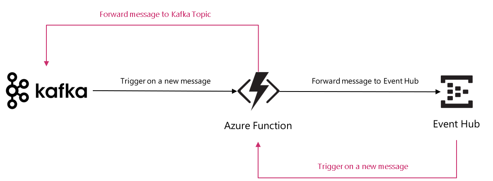

# aiskafka-af

Azure Function sample with 2 triggers:
- EventHubTrigger: will be triggered when a message is posted into an Event Hub, and will forward the message to a Kafka Topic
- KafkaTrigger: will be triggered when a message is posted into a Kafka Topic, and will forward the message to an Event Hub

This Azure Function uses the Kafka Extention: https://github.com/Azure/azure-functions-kafka-extension
So, you'll have to clone it, in order to compile this function.

I've installed Kafka on Windows and Linux, and added some of the commands I've used in the .bat/.sh files.
On Windows I've used the Offset Explorer 2.1: https://www.kafkatool.com/download.html

## Architecture

The architecture uses an Azure Function with 2 triggers, EventHubTrigger and KafkaTrigger. 